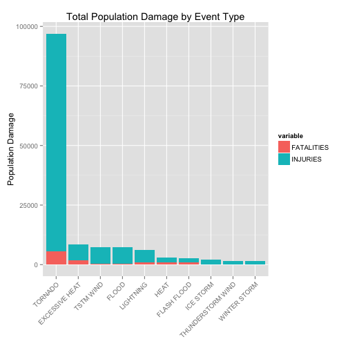
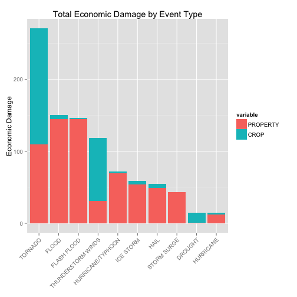

Tornado are the event with most impact on USA
=============================================

## Synopsis

This report describes how Tornadoes have a direct damage impact in both, population and economics, in the USA.

Based on the *Storm Data* database, which is an official publication of the **National Oceanic and Atmospheric Administration (NOAA)**, this reports makes a preliminar analysis in order to know which type of storm events are the most harmful, with respect to population damage, and economic impact (property and crop damage).

The events contained in the dataset are from years 1950 to 2011, although the more recent years are the more complete and rich, due to the lack in early years for collect data.


## Data Processing

As mentioned earlier, this dataset is a publication of the NOAA, but this report used a special dataset from the Reproducible Research course on Coursera, which can be downloaded [here](https://d396qusza40orc.cloudfront.net/repdata%2Fdata%2FStormData.csv.bz2).

Once downloaded, the following code reads the dataset, and show the names of the variables contained in it:


```r
storm <- read.csv("repdata-data-StormData.csv.bz2")
names(storm)
```

```
##  [1] "STATE__"    "BGN_DATE"   "BGN_TIME"   "TIME_ZONE"  "COUNTY"    
##  [6] "COUNTYNAME" "STATE"      "EVTYPE"     "BGN_RANGE"  "BGN_AZI"   
## [11] "BGN_LOCATI" "END_DATE"   "END_TIME"   "COUNTY_END" "COUNTYENDN"
## [16] "END_RANGE"  "END_AZI"    "END_LOCATI" "LENGTH"     "WIDTH"     
## [21] "F"          "MAG"        "FATALITIES" "INJURIES"   "PROPDMG"   
## [26] "PROPDMGEXP" "CROPDMG"    "CROPDMGEXP" "WFO"        "STATEOFFIC"
## [31] "ZONENAMES"  "LATITUDE"   "LONGITUDE"  "LATITUDE_E" "LONGITUDE_"
## [36] "REMARKS"    "REFNUM"
```


The dataset is composed by 902297 observations and 37 variables from all the states of USA across the years 1950-2011.

A new column is added, which contains the year of the observation as a factor, for use in later calculations.


```r
storm$YEAR <- strptime(storm$BGN_DATE, "%m/%d/%Y %H:%M:%S")$year + 1900
storm$YEAR <- as.factor(storm$YEAR)
```


There are 985 types of storm events, and the top 10 with more occurrences are:


```r
sort(table(storm$EVTYPE), decreasing = TRUE)[1:10]
```

```
## 
##               HAIL          TSTM WIND  THUNDERSTORM WIND 
##             288661             219940              82563 
##            TORNADO        FLASH FLOOD              FLOOD 
##              60652              54277              25326 
## THUNDERSTORM WINDS          HIGH WIND          LIGHTNING 
##              20843              20212              15754 
##         HEAVY SNOW 
##              15708
```


Although the above events are the ones with more occurrences, this report analyzes which events have most impact in population and economic damage.


### Population Health Damage

In order to analyze the type of event with most impact, a subset of the data is store as a new dataset, and the variables **FATALITIES** and **INJURIES** are summarized and grouped by the type of event.


```r
# New dataset
populationDMG <- storm[, c("EVTYPE", "YEAR", "STATE", "FATALITIES", "INJURIES")]

# Summarized data
population.damage <- aggregate(cbind(populationDMG$FATALITIES, populationDMG$INJURIES, 
    (populationDMG$FATALITIES + populationDMG$INJURIES)) ~ populationDMG$EVTYPE, 
    FUN = sum)
population.damage <- population.damage[order(population.damage[, 4], decreasing = T), 
    ]
names(population.damage) <- c("EVENT", "FATALITIES", "INJURIES", "TOTAL")
population.damage <- population.damage[1:10, ]
population.damage$EVENT <- reorder(population.damage$EVENT, sort(population.damage$TOTAL, 
    decreasing = F))
```


### Economic Impact

As the *Storm Data* documentation describes, the economic damage are contained in two columns, one for the Property Damage (**PROPDMG**), and the other for the Crop Damage (**CROPDMG**).

The values in this columns are associated with other two variables (**PROPDMGEXP** and **CROPDMGEXP**), which specifies if the value are stored as thousands, millions or billions of dolars.

Although there are other categories in the above columns, the *Storm Data* documentation does not specifies these categories, so this report only analyzes the values for thousands (represented as "**K**" or "**k**"), millions (represented as "**M**" or "**m**"), and billions (represented as "**B**" or "**b**").

This code creates a new dataset with the columns specified above, and make the necessary changes to the values, in order to use the same scale on it, in this case, billion of dolars.


```r
econDMG <- storm[, c("EVTYPE", "YEAR", "STATE", "PROPDMG", "PROPDMGEXP", "CROPDMG", 
    "CROPDMGEXP")]
econDMG <- subset(econDMG, econDMG$PROPDMGEXP %in% c("b", "B", "m", "M", "k", 
    "K") | econDMG$CROPDMGEXP %in% c("b", "B", "m", "M", "k", "K"))

econDMG$PROPDMG[toupper(econDMG$PROPDMGEXP) == "M"] <- econDMG$PROPDMG[toupper(econDMG$PROPDMGEXP) == 
    "M"]/1000
econDMG$PROPDMG[toupper(econDMG$PROPDMGEXP) == "K"] <- econDMG$PROPDMG[toupper(econDMG$PROPDMGEXP) == 
    "K"]/1e+06
econDMG$CROPDMG[toupper(econDMG$CROPDMGEXP) == "M"] <- econDMG$CROPDMG[toupper(econDMG$CROPDMGEXP) == 
    "M"]/1000
econDMG$CROPDMG[toupper(econDMG$CROPDMGEXP) == "K"] <- econDMG$CROPDMG[toupper(econDMG$CROPDMGEXP) == 
    "K"]/1e+06
```


With this new dataset, the data is summarized using the economic variables, and grouped by the top 10 events with more economic impact.


```r
economic.damage <- aggregate(cbind(econDMG$PROPDMG, econDMG$CROPDMG, (econDMG$PROPDMG + 
    econDMG$CROPDMG)) ~ econDMG$EVTYPE, FUN = sum)
economic.damage <- economic.damage[order(economic.damage[, 4], decreasing = T), 
    ]
names(economic.damage) <- c("EVENT", "PROPERTY", "CROP", "TOTAL")
economic.damage <- economic.damage[1:10, ]
economic.damage$EVENT <- reorder(economic.damage$EVENT, sort(economic.damage$TOTAL, 
    decreasing = F))
```


## Results

### Population Health Damage

Based on the data calculated above, the top 10 events with the most damage in Population Health are:


```r
population.damage
```

```
##                 EVENT FATALITIES INJURIES TOTAL
## 834           TORNADO       5633    91346 96979
## 130    EXCESSIVE HEAT       1903     6525  8428
## 856         TSTM WIND        504     6957  7461
## 170             FLOOD        470     6789  7259
## 464         LIGHTNING        816     5230  6046
## 275              HEAT        937     2100  3037
## 153       FLASH FLOOD        978     1777  2755
## 427         ICE STORM         89     1975  2064
## 760 THUNDERSTORM WIND        133     1488  1621
## 972      WINTER STORM        206     1321  1527
```


The following plot shows the distribution in both categories, FATALITIES and INJURIES:


```r
# melt data for plotting
library(reshape2)
meltedData <- melt(population.damage[, 1:3], id.vars = 1)

# plot
library(ggplot2)
ggplot(data = meltedData, aes(x = EVENT, y = value, fill = variable)) + geom_bar(stat = "identity") + 
    labs(y = "Population Damage") + labs(title = "Total Population Damage by Event Type") + 
    theme(axis.title.x = element_blank(), axis.text.x = element_text(angle = 45, 
        hjust = 1))
```

 


These results clearly shows that TORNADO are by far the most harmful event with respect to population health, with more than 10 times the second event (EXCESSIVE HEAT)


### Economic Damage

Based on the calculated data, these are the top 10 events which caused the most economic impact:


```r
economic.damage
```

```
##                  EVENT PROPERTY      CROP  TOTAL
## 351            TORNADO  109.937 1.604e+02 270.35
## 70               FLOOD  144.658 5.662e+00 150.32
## 58         FLASH FLOOD  144.541 1.421e+00 145.96
## 325 THUNDERSTORM WINDS   30.736 8.819e+01 118.93
## 193  HURRICANE/TYPHOON   69.306 2.608e+00  71.91
## 202          ICE STORM   53.945 5.022e+00  58.97
## 113               HAIL   48.732 6.026e+00  54.76
## 297        STORM SURGE   43.324 5.000e-06  43.32
## 38             DROUGHT    1.046 1.397e+01  15.02
## 185          HURRICANE   11.868 2.742e+00  14.61
```


The plot below shows the economic damage caused by these events, and distributed by the type of economic damage as property or crop:


```r
# melt data for plotting
library(reshape2)
meltedData <- melt(economic.damage[, 1:3], id.vars = 1)

# plot
library(ggplot2)
ggplot(data = meltedData, aes(x = EVENT, y = value, fill = variable)) + geom_bar(stat = "identity") + 
    labs(y = "Economic Damage") + labs(title = "Total Economic Damage by Event Type") + 
    theme(axis.title.x = element_blank(), axis.text.x = element_text(angle = 45, 
        hjust = 1))
```

 


As the results shown, again TORNADO are the event with the most economic impact in billions of dolars in total. 

But, the results shows that there are other two events that have more Property damage than TORNADO, these are FLOOD and FLASH FLOOD, in this order.

Furthermore, the event THUNDERSTORM WINDS have almost the half of economic impact as TORNADO, as is shown in the table and the plot.

Analyzing the data with only TORNADO event, the top 10 states with the most harmful population damage are:


```r
tornado.damage <- aggregate(cbind(populationDMG$FATALITIES, populationDMG$INJURIES, 
    (populationDMG$FATALITIES + populationDMG$INJURIES)) ~ populationDMG$STATE, 
    subset = populationDMG$EVTYPE == "TORNADO", FUN = sum)
tornado.damage <- tornado.damage[order(tornado.damage[, 4], decreasing = T), 
    ]
names(tornado.damage) <- c("STATE", "FATALITIES", "INJURIES", "TOTAL")
tornado.damage <- tornado.damage[1:10, ]
tornado.damage
```

```
##    STATE FATALITIES INJURIES TOTAL
## 45    TX        538     8207  8745
## 2     AL        617     7929  8546
## 26    MS        450     6244  6694
## 3     AR        379     5116  5495
## 37    OK        296     4829  5125
## 44    TN        368     4748  5116
## 25    MO        388     4330  4718
## 36    OH        191     4438  4629
## 16    IN        252     4224  4476
## 15    IL        203     4145  4348
```


With respect to economic damage, the top 10 states with the most are:


```r
tornado.damage2 <- aggregate(cbind(econDMG$PROPDMG, econDMG$CROPDMG, (econDMG$PROPDMG + 
    econDMG$CROPDMG)) ~ econDMG$STATE, subset = econDMG$EVTYPE == "TORNADO", 
    FUN = sum)
tornado.damage2 <- tornado.damage2[order(tornado.damage2[, 4], decreasing = T), 
    ]
names(tornado.damage2) <- c("STATE", "PROPERTY", "CROP", "TOTAL")
tornado.damage2 <- tornado.damage2[1:10, ]
tornado.damage2
```

```
##    STATE PROPERTY      CROP   TOTAL
## 13    IA   52.287 1.600e+02 212.292
## 2     AL    6.321 5.680e-02   6.378
## 37    OK    6.269 5.056e-02   6.319
## 25    MO    4.801 2.227e-02   4.823
## 45    TX    3.721 8.189e-02   3.803
## 11    GA    3.261 1.079e-02   3.272
## 17    KS    2.670 1.227e-02   2.682
## 16    IN    2.595 5.160e-04   2.595
## 3     AR    2.590 1.507e-03   2.592
## 26    MS    2.442 5.414e-02   2.496
```


As the results shown, the state with the most impact with respect population health is Texas, and the one with the most economic damage is Iowa.
